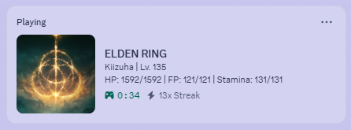
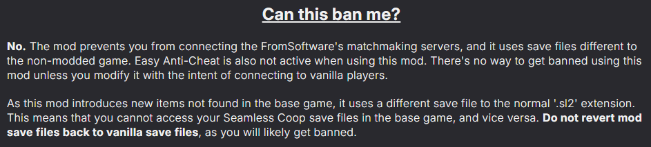

<h1 align="center">Elden Ring Presence</h1>

A Discord Rich Presence tool for the **Elden Ring**, This application reads the game's memory to update your RPC activity.

---

> [!CAUTION]
> BEFORE USING THIS APPLICATION, YOU MUST **<ins>DISABLE EASY ANTI-CHEAT (EAC)</ins>** AND PLAY IN OFFLINE MODE.
>
> THE AUTHOR OF THIS APPLICATION IS NOT RESPONSIBLE FOR ANY RISK TO YOUR ACCOUNT, INCLUDING BANS.

> [!WARNING]
> THIS METHOD IS A GRAY ZONE AND **<ins>YOU MAY STILL RISK BEING BANNED</ins>**, THIS APPLICATION HAS **<ins>NOT BEEN TESTED</ins>** IN OFFICIAL ONLINE MODE (CONNECTED TO FROMSOFTWARE'S SERVERS).

> [!TIP]
> If you want to use this application while playing in online mode, you can use the [Seamless Coop Mod](https://www.nexusmods.com/eldenring/mods/510). Please read the guide carefully on how to set up the mod, especially the section regarding game save file warnings.

